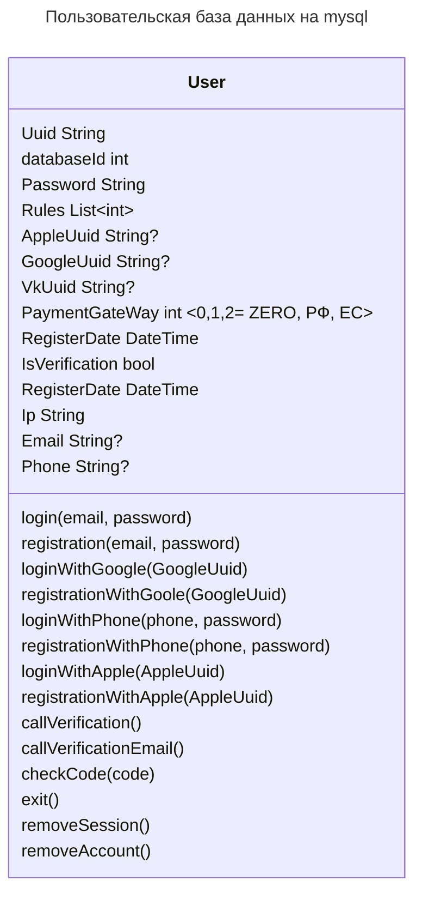
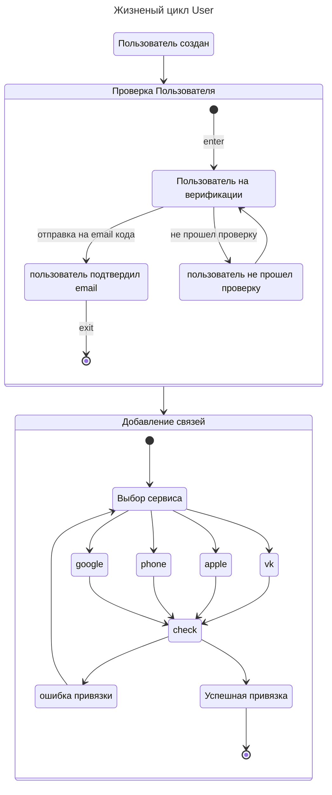

# Проектирование сервиса 

## User
Логика работы с Пользователями внутри Сервиса
 **  **

## Localization 
** mongoDB ** 

## Settings 
** MySQL **
## FileStorage 
** Alfred **
## Push 
** firebase **
## PayGateway 
** Alfred **
